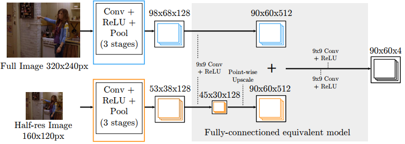

## An implementation of ["Joint Training of a Convolutional Network and a Graphical Model for Human Pose Estimation"](http://papers.nips.cc/paper/5573-joint-training-of-a-convolutional-network-and-a-graphical-model-for-human-pose-estimation)
#### Maksym Andriushchenko, Fan Yue

This is a TensorFlow implementation of [the paper](http://papers.nips.cc/paper/5573-joint-training-of-a-convolutional-network-and-a-graphical-model-for-human-pose-estimation), 
which became quite influential in the human pose estimation task (~450 citations).

Here is an example of joints detection based on FLIC dataset produced with our implementation:


TODO: add 1 PD + 1 SM pictures from TensorBoard


## Main Idea
The authors propose a fully-convolutional approach. As input they use multiple images of different resolutions 
that aim to capture the spatial context of a different size. These images are processed by a series of 5x5 
convolutional and max pooling layers. Then the feature maps from different resolutions are added up, followed 
by 2 large 9x9 convolutions. The final layer with 90x60xK feature maps (where K is the number of joints) is our
predicted heat maps. We use then softmax and cross-entropy loss on top of them together with the ground truth 
heat maps, which we form by placing a small 3x3 binomial kernel on the actual joint position (see `data.py`).

<!--  -->

Note, that the input resolution 320x240 is not justified at all in the paper, and it is not clear how one can 
arrive at 98x68 or 90x60 feature maps after 2 max pooling layers. It is quite hard to guess what the authors 
really did here. Instead we use what makes more sense to us: processing of the full resolution 720x480 images, 
but first convolution is applied with stride=2, making all dimensions of feature maps comparable in size with 
what proposed in the paper.

The described part detector already gives good results, however there are also some mistakes that potentially 
can be ruled out by applying a spatial model. For example, in the third image below there are many false detections 
of hips (pink color), which clearly do not meet kinematic constraints w.r.t. nose and shoulders that are often
detected with very high accuracy.


So the goal is to get rid of such false positives that clearly do not meet kinematic constraints. Traditionally, 
for such purposes a probabilistic graphical model was used. One of the most popular choices is a tree-structured 
graphical model, because of the exact inference combined with efficiency due to gaussian pairwise priors, 
which are most often used. Some approaches combined exact inference with hierarchical structure of a graphical 
model. Another approaches relied on approximate inference with a loopy graphical model, that allowed to establish 
connections between symmetrical parts.

An important novelty of this paper is that the spatial model can be modeled as a fully connected graphical 
model with parameters that can be trained jointly with the part detector. Thus the graphical model can be 
learned from the data, and there is no need to design it for a specific task and dataset, which is a clear 
advantage. The schematic description of such spatial model is given below:


We can see a few examples below of how our spatial model trained jointly with the part detector performs 
compared to the part detector only. 
On the 1st example we can see that there is a detection of hip of backward facing person. However, 
this hip does not have any other body parts in its vicinity, so it is ruled out by the spatial model.
On the 2nd example there are a few joint detections of person standing on right, and also a minor 
detection of wrist on the left (small yellow cloud). All of them are ruled out by the spatial model. 
Note, that there are still some mistakes, but rigorous model evaluation in Section~3 reveals that we 
indeed get a significant improvement by applying the spatial model.


Surprisingly, we didn't find any implementation in the internet. It can be explained by the fact that the original paper 
doesn't list any hyperparameters and doesn't provide many implementation details. Thus, it is extremely hard to
reproduce, and we decided to add reasonable modifications from the recent papers to improve the results.


## Difference from the paper
Since the original paper was quite hard to reproduce, we introduced the following changes:
- BN speeds up the convergence
- Cross-entropy loss speeds up the convergence and improves the detection accuracy
- Multi-task loss
- Adam for joint training. Original paper was not really "joint".
- ...


## How to run the code
1. download FLIC dataset
2. `data.py`
3. `pairwise_distr.py`
4. `python main.py --data_augm --use_sm --optimizer=adam --lr=0.001 --lmbd=0.0001 --n_epochs=60`


Supported options:
- `debug`: 
- `multi_gpu`: BatchNorm can have problems with low batch size
- `data_augm`: 
- `use_sm`: whether to use the Spatial Model (SM) or not
- `restore_model`: if you want to restore an existing model, name of which should be specified in `best_model_name` variable.
Or you can get further information on different arguments with: `python worker.py --help`.


Datasets (you will need to have them in the folder data/, for details please see `data.py`):
- `FLIC`
- `FLIC+`

Note that the script `main.py` saves tensorboard summaries (folder `tb`), model parameters (folder `models_ex`). 


## Contact
For any questions regarding the code please contact Maksym Andriushchenko (m.**my surname**@gmail.com).
Any suggestions are always welcome.


## Citation
You can cite the original paper as:
```
@inproceedings{tompson2014joint,
  title={Joint training of a convolutional network and a graphical model for human pose estimation},
  author={Tompson, Jonathan J and Jain, Arjun and LeCun, Yann and Bregler, Christoph},
  booktitle={Advances in neural information processing systems},
  pages={1799--1807},
  year={2014}
}
```